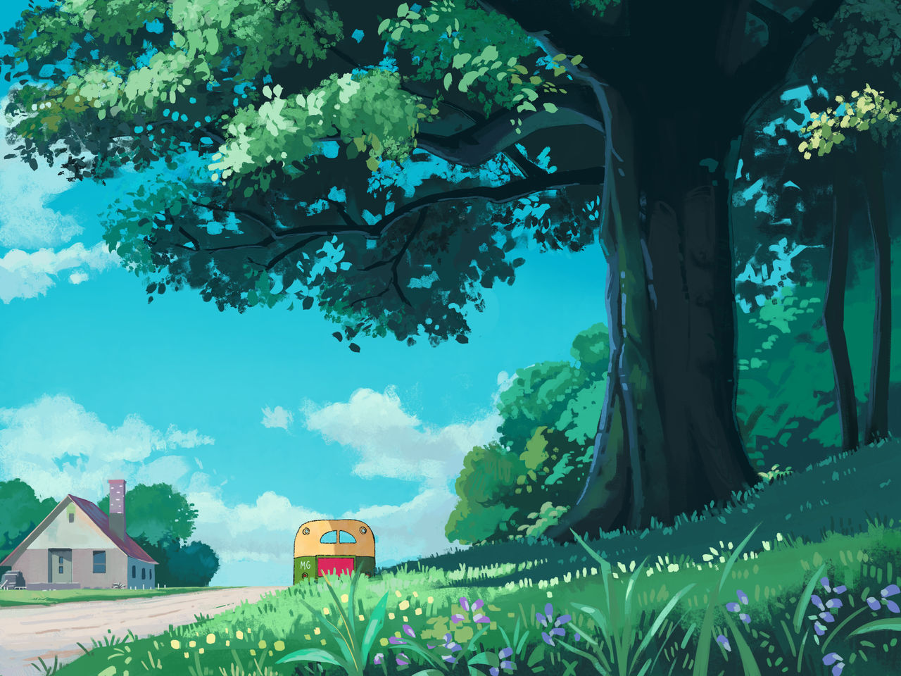

# Neural Style Transfer 

This project implements a basic single-style transfer model based on the original paper [A Neural Algorithm of Artistic Style](https://arxiv.org/pdf/1508.06576)

---
**Set up**

Requires PyTorch installation.

Input content image + style image into appropriate directories + add directory path in code file.

---
**What is Neural Style Transfer?**

Style transfer is a technique in computer vision where we take two images-- one which is the content reference and one which is the style reference --and we blend them together to create an output image. 

---
**Example Training Results**

Content Image:

Style Image:

Generated Image:

---
**Architecture**

The architecture is built of two parts: A pre-trained feature extractor and transfer network. In this project, VGG19 is used as the feature extractor.

Feature Network:  
Following the original paper, we extract the style of the image from 5 initial convolution layers. Intuitively, this is because style corresponds to the relationships between lower-level features (etc. colours, contrasts) of an image. We then represent this as a Gram matrix
- Gram matrix: W * W_transpose (you can think of each row as a feature map)
- We then use this matrix to build a loss function for the content and a loss function for the style
    - Total loss = a(content loss) + b(style loss)
    - a and b are weights

Transfer Network:  
This is the network that finds the image that minimizes the loss function. In the original paper, the inputs to this network are the loss function and a blank canvas. However, for this project, we use the initial content image as the seed for the network.

---
**Next Steps**
- Fast Neural Style Transfer Algorithm (done via one forward pass)
- Single Style per Model
- Abitrary Styles per Model
- Stable Style Transfer (for videos)

---
**Sources**
- https://fritz.ai/style-transfer/
- https://arxiv.org/pdf/1508.06576
- https://youtu.be/imX4kSKDY7s?si=dn7PPb7Zsd5P9SgG 
